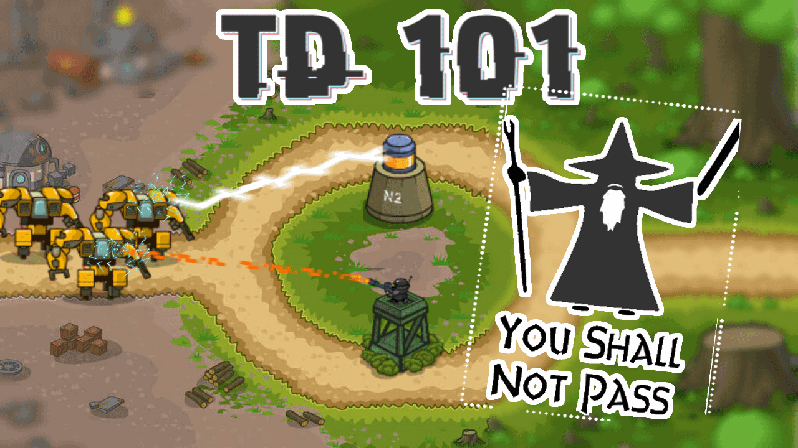

# [Game TD-101](https://spb-td101-4.ya-praktikum.tech)



## Игра

Tower Defense - Задача игрока построить оборону из башен на пути вражеских сил и не дать им пройти.

_Плюсы_

- свобода в графике и эффектах
- динамичный геймплей
- простота управления
- нет мультиплеера (если будет нужна то реализация ближе к пошаговым)

_Минусы_

- сложность в реализации механики стрельбы
- большой объем в реализации контента
- балансировка

## Сеттинг, графика, интерфейс

Киберпанк

## Начать вклад в проект

- [Документация проекта](./docs/README.md)

### Общие скрипты

#### Установка

```
npm i
```

### Разработка

**Запуск базы данных**
Запускает в докере бд (необходимо настроить dev.env)

```
npm run docker:dev
```

**Запуск проекта**
Запускает клиент и сервер в режиме разработки (до этого необходимо запустить в докере бд и настроить dev.env)

```
npm start
```

**Запуск линтера и форматтера**
проверка сразу для ts и стилей

```
npm run lint
```

автоисправление сразу для ts и стилей

```
npm run fix
```

**Запуск тестов**

```
npm test
```

Обновление снапшотов

```
npm test -- -u
```

**Генерация сертификатов**
подробнее в [SSL](./docs/SSl.md)

```
npm run ssl
```

**Добавление домена в файл hosts**

```
npm run hosts
```

### Сборка

собирает клиент и сервер в режиме производства

```
npm run start:server
```

собирает контейнер приложения для докера

```
npm run docker:app
```

поднимает все контейнеры в докере

```
npm run docker:prod
```

## Команда

|                                                                          |                                                                          |                                                                          |                                                                          |
| ------------------------------------------------------------------------ | ------------------------------------------------------------------------ | ------------------------------------------------------------------------ | ------------------------------------------------------------------------ |
| ментор                                                                   | участник                                                                 | участник                                                                 | участник                                                                 |
| Евгений Городилов                                                        | Никита Строганов                                                         | Катя Блинова                                                             | Денис Спиридонов                                                         |
|  |  |  |  |
