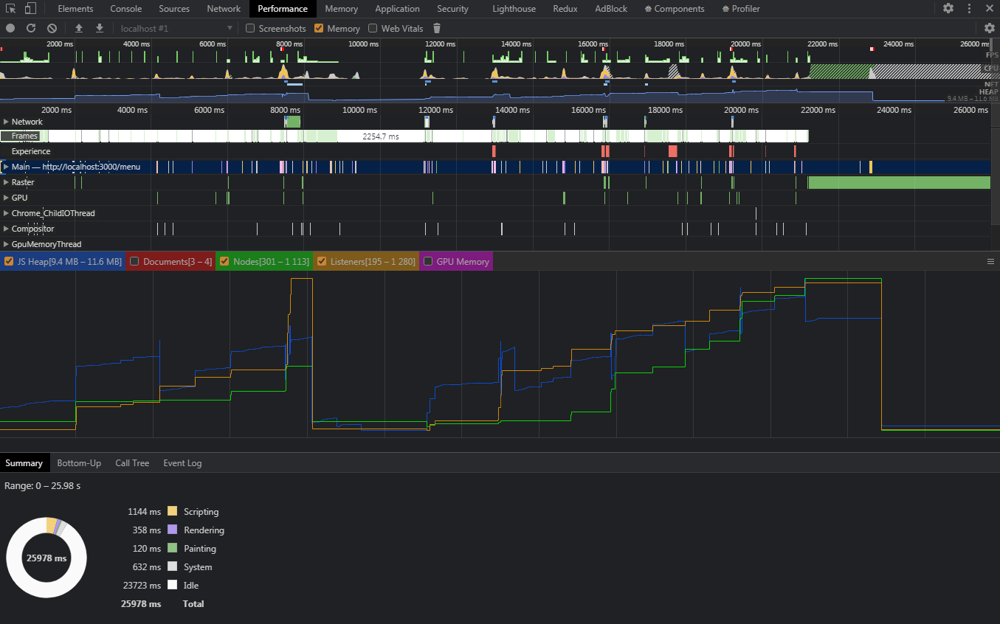
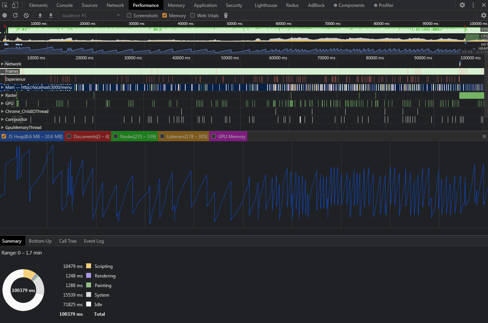

На версии 1.0.0 утечек памяти не обнаружено.

Переходя по страницам и прогоняя стандартные пользовательские сценарии корректно создаются и удаляются обработчики событий и ноды.

Во время игры память выделяется и освобождается равномерно количеству эффектов на сцене, каждая волна увеличивает занимаемой памяти но когда волна заканчивается - сборщик корректно всё удаляет.

