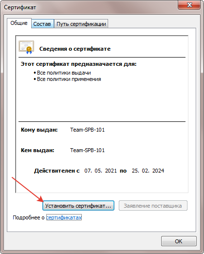
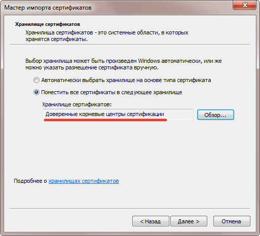

# Добавление сертификата для разработки на https

## Создание сертификата

```
npm run ssl
```

Что делает скрипт `ssl.sh`

1. Выпускает ключи и сертификат для доверенного корневого центра сертификации (RootCA)
2. На основе RootCA выпускает сертификат для localhost
   настроить доменные имена можно в файле scripts/domains.ext

## Установка сертификата (скриншоты из win7)

Открываем файл RootCA.crt и устанавливаем в хранилище доверенных корневых центров сертификации  
Соглашаемся с предупреждением безопасности  



Альтернативная установка через браузер

**Chrome**  
`chrome://settings/security` > `Certificats` > `Import` > `RootCA.crt` > `Trusted Root Certification Authorities`> `Done`.

**Firefox**  
`about:preferences#privacy` > `Certificats` > `Import` > `RootCA.pem` > `Confirm for websites`.

## Добавление псевдонима на доменное имя

(только для Windows и Linux)

```
npm run hosts
```

или дописать в файл hosts

```
127.0.0.1 local.ya-praktikum.tech
```

| OS         | Path                                    |
| ---------- | --------------------------------------- |
| Windows 10 | `C:\Windows\System32\drivers\etc\hosts` |
| Linux      | `/etc/hosts`                            |
| Mac OS X   | `/private/etc/hosts`                    |

Теперь разработка доступна на `https://local.ya-praktikum.tech:3000`
